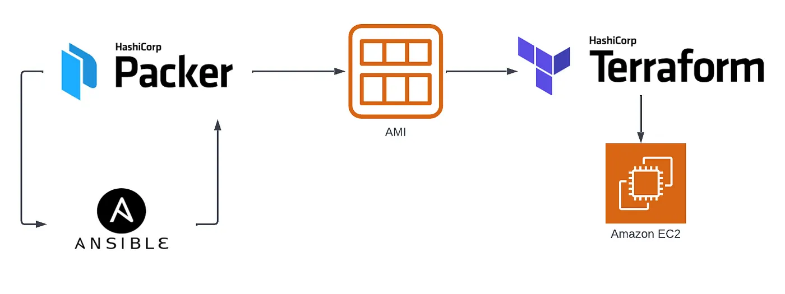

## Table of contents

- [Quick start](#quick-start)
- [Architecture](#architecture)
- [Creators](#creators)


## Quick start
There are a few assumptions about the terraform code.
<ol>
  <li>The terraform s3 state bucket must be created in the right account in us-west-1 as tfstate-bucket-$(ACCOUNT)</li>
  <li>You have created a ssh key at ~/.ssh/id_rsa.pub</li>
  <li>The terraform code should be immutable</li>
  <li>Mutable code should go into the terraform wrapper -> Makefile</li>
</ol>

Running the code should be as easy as
<ul>
  <li>`make setup`</li>
  <li>`make plan`</li>
  <li>`make apply`</li>
  <li>`make destroy`</li>
</ul>

## Architecture


```
.
├── Makefile
├── README.md
├── packer-ansible-terraform.png
├── ec2
│   ├── Makefile
│   ├── README.md
│   ├── backend.tf
│   ├── data.tf
│   ├── doc.txt
│   ├── ec2.tf
│   ├── locals.tf
│   ├── outputs.tf
│   ├── providers.tf
│   ├── user-key.tf
│   └── variables.tf
└── modules
    └── terraform-aws-ec2-instance
```

## Creating a ssh key
```
$ ssh-keygen -t rsa -b 4096 -C "your_email@example.com"
```

## Creators
- Kirk Larsen - kirkl@slalom.com
- Sahithya Kodam - sahithya.kodam@slalom.com
- Kyle Clayborn - kyle.claycomb@slalom.com
